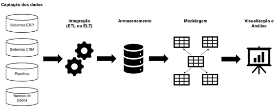
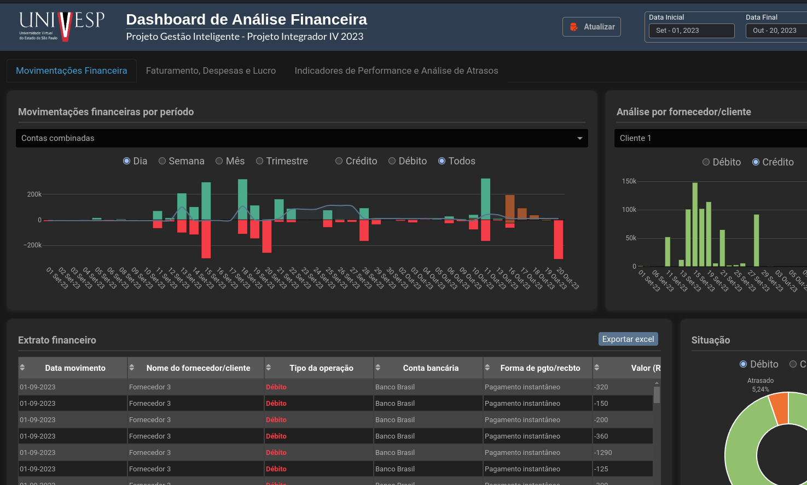
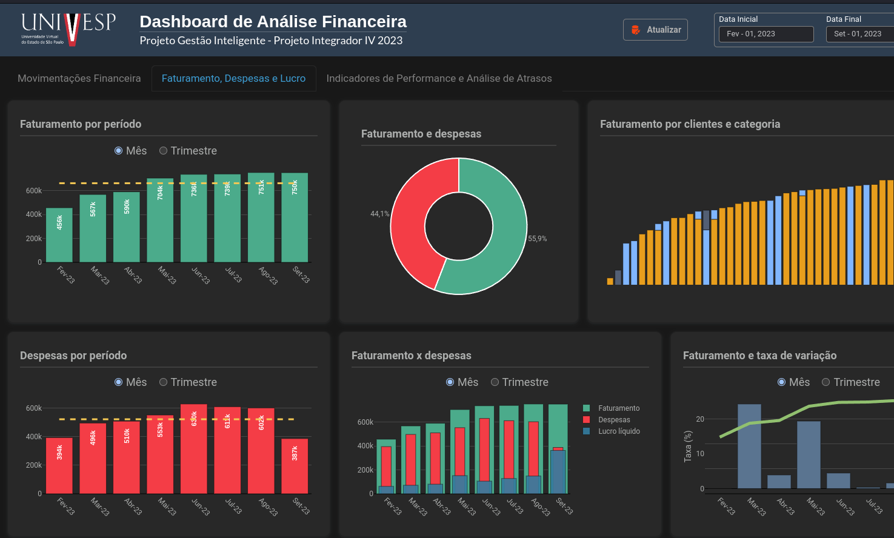

<br />

# Projeto Integrador IV - Univesp - 2023

Projeto acadêmico como disciplina curricular do 7° período de 2023.

<br />

## Requisitos

O Projeto Integrador IV tem como objetivo desenvolver análise de dados em escala utilizando algum conjunto de dados existentes ou capturados por IoT e aprendizagem de máquina. Preparar uma interface para visualização dos resultados.

<br />

## Tema proposto

Solução BI (Business Intelligence) com painel analítico como instrumento empresarial integrado com sistema ERP para facilitar o processo da gestão financeira em tempo real.

<br />

## Título

Projeto Gestão Inteligente

<br />

## Descrição

Criar uma aplicação web na forma de dashboard com o objetivo de mapear e visualizar dados relevantes sobre o desempenho empresarial, permitindo que gestores e tomadores de decisão tenham acesso a informações em tempo real e possam tomar decisões mais informadas e estratégicas.

<br />

## Tecnologias utilizadas

### Desenvolvimento

```
Python
Framework Dash Plotly
Pandas
Numpy
Sklearn
Bootstrap
HTML | CSS
Javascript
Docker | Docker compose
```

### Servers

```
Gurnicorn server
Caddy Server 
```

### Ferramentas

```
VScode 
Orange Canvas - Preprocessamento e Machine learning
```

<br />

## Implantação

### Arquitetura de implantação

```
Microsserviços
Orquestração - Docker Compose
```

### IaaS utilizada

```
Amazoon AWS
```

### Escopo do pipeline

<br />
<h3 align="center">
  
</h3>

<br />

### VPS

```
Ubuntu 20.04 LTS
1 vCPU 1GB Ram
50 GB SSD
```

<br />

## Projeto

<br />
<h3 align="center">
  
</h3>

<br />
<h3 align="center">
  
</h3>

## License

[MIT](https://choosealicense.com/licenses/mit/)
